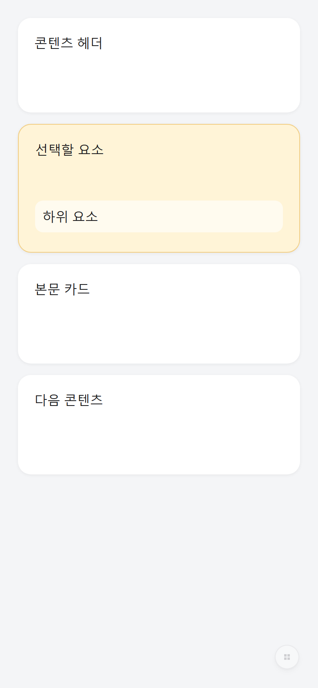
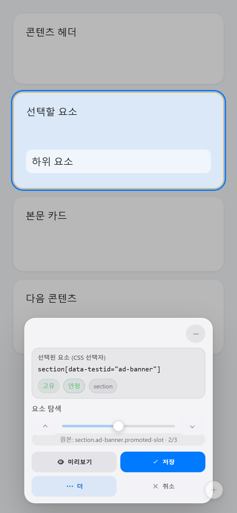
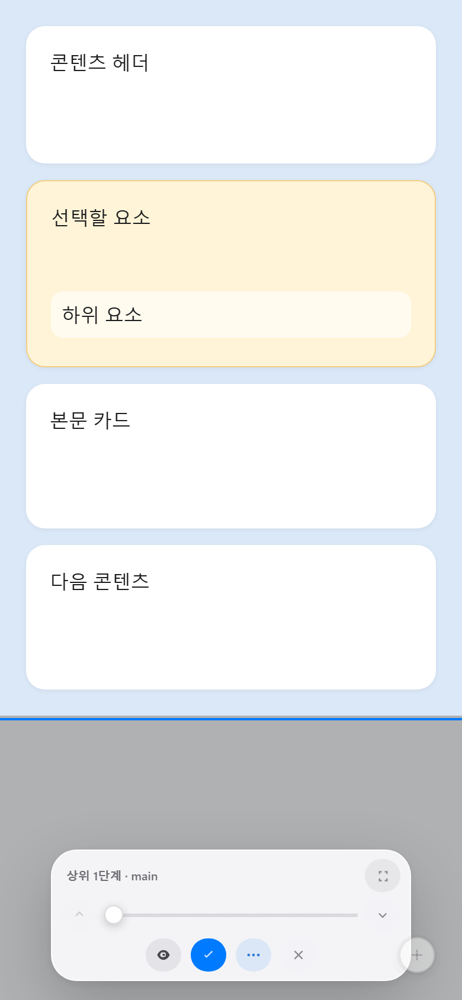
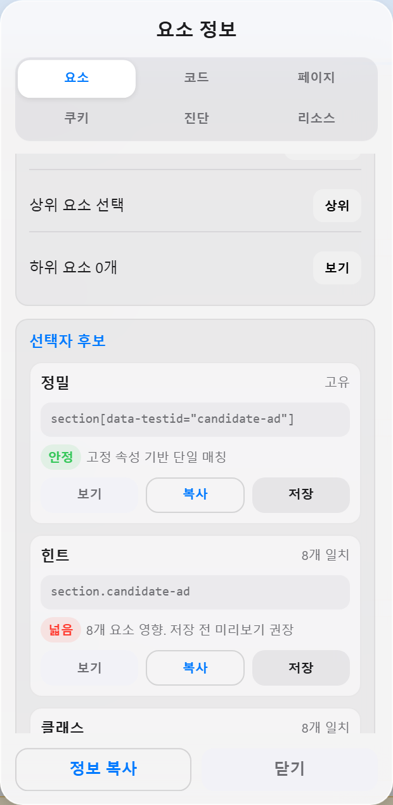
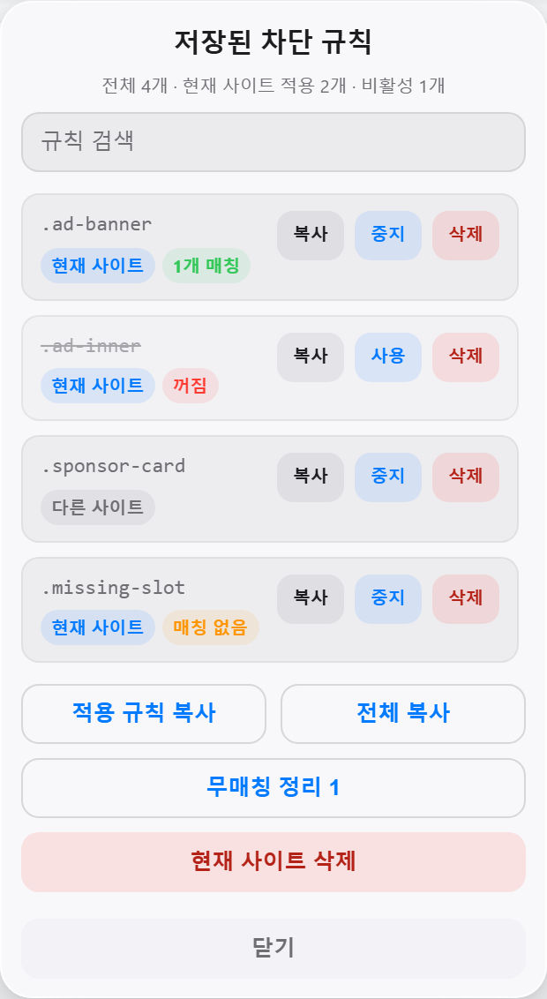
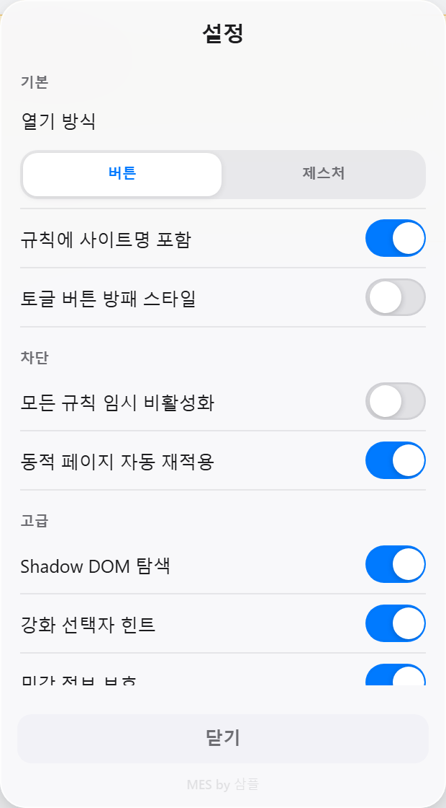
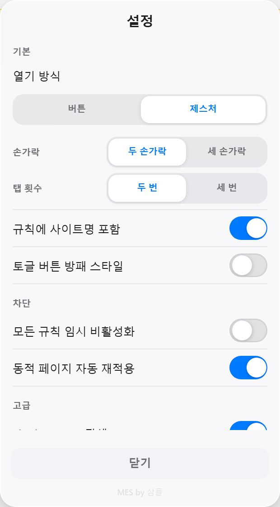
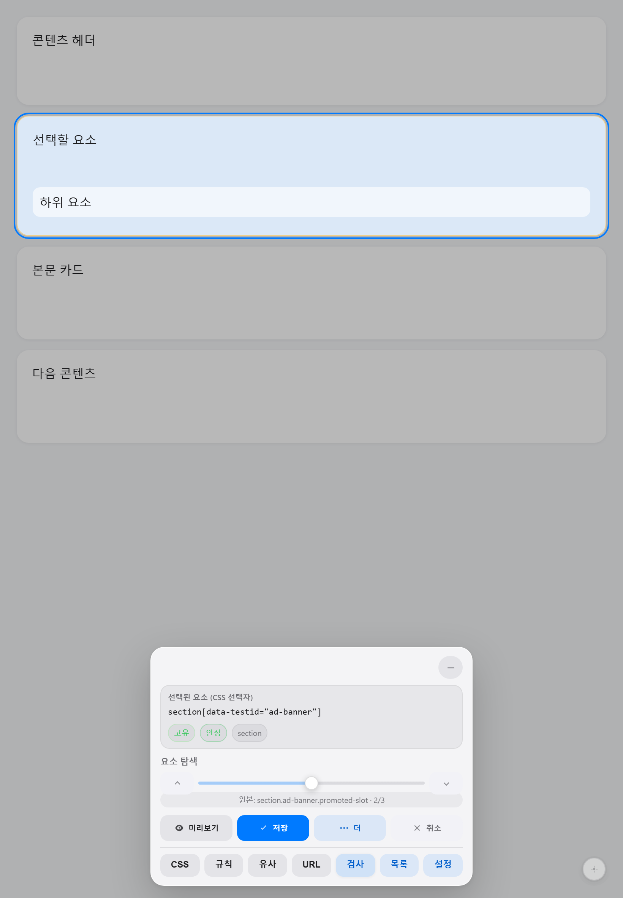
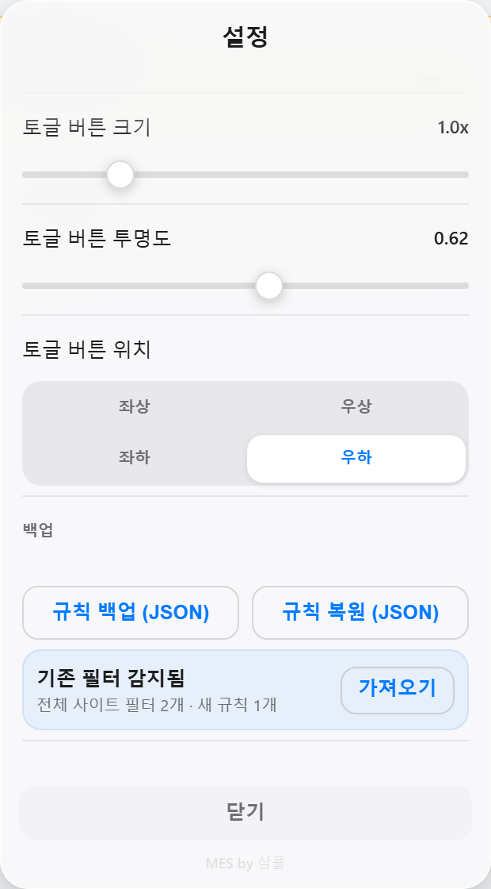

# MES (Mobile Element Selector)

MES는 모바일 브라우저에서 웹페이지 요소를 직접 선택하고 숨김 규칙을 관리할 수 있는 고급 userscript입니다. 작은 화면에서도 덜 가리는 컴팩트한 패널, 안정적인 선택자 생성, 저장 규칙 관리, 동적 페이지 재적용을 중심으로 설계했습니다.

[GitHub에서 설치](https://raw.githubusercontent.com/sampple-korea/MES/main/MES.js) · [소스 코드](https://github.com/sampple-korea/MES)

## 2.0.0

MES 2.0.0은 1.x 계열에서 UI, 선택자 품질, 규칙 관리, 동적 감시, Shadow DOM 대응, 차단 무결성 복구를 크게 강화한 메이저 업데이트입니다.

자세한 변경점은 [RELEASE_NOTES_2.0.0.md](RELEASE_NOTES_2.0.0.md)를 참고하세요.

## 주요 기능

- 모바일 터치에 맞춘 요소 선택기와 상위/하위 요소 탐색
- 저장 전 선택자 품질과 위험도 표시
- 정밀, 유사 패턴, 속성, 클래스, 리소스 기반 선택자 후보 제공
- 저장 규칙 검색, 복사, 활성/비활성, 현재 사이트 정리, 백업, 복원
- 저장 직후 실행 취소와 현재 페이지 매치 영향 미리보기
- 현재 페이지에서 더 이상 매치되지 않는 오래된 규칙 정리
- open Shadow DOM 내부 선택과 host 범위 규칙 생성
- DOM 변경, class/id/hidden 속성 변경, Shadow DOM 변경 후 규칙 재적용
- 페이지가 숨김 스타일이나 규칙 stylesheet를 건드려도 다시 복구하는 차단 무결성 보호
- CSS 규칙 기반 숨김과 민감하거나 지원되지 않는 선택자용 inline fallback
- 페이지가 MES UI 노드, ID, class, hidden 상태, style을 바꿔도 복구하는 UI 자가 치유
- display, visibility, opacity, CSS 기반 숨김 방식
- HTML, 계산된 CSS, 스크립트 힌트, 페이지 소스, 쿠키, 리소스, 진단을 볼 수 있는 인스펙터
- 선택 요소와 주변 범위를 집중해서 보는 포커스 모드
- 쿠키와 리소스 URL의 민감 정보를 기본적으로 가리는 개인정보 보호 모드
- 쿠키 복사, 편집, 삭제 도구
- URL과 임의 속성 추출 도구
- 작고 정돈된 모바일 UI, 컴팩트 계층 조절, 자석식 패널 정렬, 태블릿 대응 레이아웃
- 버튼 런처와 제스처 런처 전환
- 기존 필터 데이터가 감지될 때만 표시되는 마이그레이션 메뉴
- 낮은 대비의 작은 원형 런처와 선택형 방패 아이콘

## 기능 캡처

아래 이미지는 Playwright로 실제 MES UI를 실행해 캡처한 화면입니다.

| 작은 런처 | 전체 선택 패널 |
| --- | --- |
|  |  |

| 컴팩트 선택 모드 | 선택자 후보와 위험도 |
| --- | --- |
|  |  |

| 저장 규칙 관리 | 설정 개요 |
| --- | --- |
|  |  |

| 제스처 런처 설정 | 태블릿 레이아웃 |
| --- | --- |
|  |  |

## 설치

Tampermonkey, Violentmonkey 같은 userscript 매니저를 설치한 뒤 아래 주소를 열어 설치하세요.

```text
https://raw.githubusercontent.com/sampple-korea/MES/main/MES.js
```

업데이트도 같은 GitHub 주소를 사용합니다.

## 사용 방법

1. 스크립트를 설치한 뒤 원하는 웹사이트를 엽니다.
2. 화면의 작은 MES 런처를 누릅니다.
3. 숨기고 싶은 요소를 터치합니다.
4. 상위/하위 요소 범위를 조절하고 미리보기를 확인합니다.
5. 선택자를 저장하면 같은 사이트에서 규칙이 자동 적용됩니다.
6. 목록과 설정 패널에서 규칙 검색, 복사, 비활성화, 삭제, 백업, 복원을 관리합니다.

## 타 MES(Picky)에서 마이그레이션

MES는 기존 필터 데이터가 감지될 때만 설정 화면에 마이그레이션 메뉴를 표시합니다. 기존 데이터가 없거나 접근할 수 없는 저장소에 있으면 이 메뉴는 보이지 않습니다.



마이그레이션 순서:

1. 기존 MES(Picky) 데이터를 지우지 않은 상태에서 같은 브라우저, 같은 프로필, 같은 userscript 매니저를 유지합니다.
2. MES를 GitHub 설치 주소로 설치하거나 업데이트합니다.
3. 필터를 사용하던 사이트를 열고 MES 런처를 누릅니다.
4. `더` 버튼을 누른 뒤 `설정`으로 들어갑니다.
5. `기존 필터 감지됨` 카드가 보이면 `가져오기`를 누릅니다.
6. 가져온 규칙은 중복을 제거한 뒤 MES 저장 규칙에 병합됩니다.
7. `목록` 패널에서 가져온 규칙의 현재 사이트 매치 수를 확인하고 필요 없는 규칙은 비활성화하거나 삭제합니다.

메뉴가 보이지 않을 때 확인할 점:

- 기존 필터 데이터를 먼저 삭제했거나 브라우저 저장소를 정리하면 감지할 수 없습니다.
- 다른 브라우저, 다른 프로필, 다른 userscript 매니저로 옮긴 경우 저장소가 달라 감지되지 않을 수 있습니다.
- 감지 메뉴는 가져올 새 규칙이 있을 때만 의미가 있습니다. 이미 같은 규칙이 MES에 있으면 중복으로 추가하지 않습니다.

## 설정

| 설정 항목 | 기본값 | 설명 |
| --- | --- | --- |
| `includeSiteName` | true | 저장 규칙에 현재 사이트 이름을 포함 |
| `panelOpacity` | 0.94 | 설정/차단 패널 투명도 |
| `toggleSizeScale` | 1.0 | 런처 버튼 크기 비율 |
| `toggleOpacity` | 0.62 | 런처 버튼 투명도 |
| `showShieldIcon` | false | 런처에 방패 아이콘 표시 |
| `observeDomChanges` | true | 동적 DOM 변경 시 저장 규칙 재적용 |
| `shadowDomSupport` | true | open Shadow DOM 내부 요소 탐색 |
| `selectorHintMode` | true | 안정적인 선택자 힌트 생성 |
| `privacyMode` | true | 쿠키와 리소스 URL의 민감 정보 보호 |
| `compactPickerMode` | true | 요소 선택 후 패널을 컴팩트 모드로 전환 |
| `hideToggleButton` | false | 버튼 런처 대신 제스처 런처 사용 |
| `gestureFingerCount` | 2 | 제스처 런처 손가락 수 |
| `gestureTapCount` | 2 | 제스처 런처 탭 횟수 |
| `hideStrategy` | stylesheet | 기본 숨김 방식 |
| `toggleBtnCorner` | bottom-right | 런처 기본 위치 |

## 개발

```bash
npm ci
npm test
```

`npm test`는 문법 검사, UI 노이즈 검사, Playwright smoke test를 실행합니다.

## 참고

- MES는 모바일 화면과 터치 조작을 우선으로 설계했습니다.
- 일부 사이트는 userscript 동작을 제한하거나 숨긴 요소를 계속 다시 만들 수 있습니다.
- CSS 규칙 숨김은 가능한 경우 constructable stylesheet를 사용하고, 필요한 경우 MES가 소유한 style 노드나 inline 숨김으로 fallback합니다.
- 쿠키 편집과 삭제는 `document.cookie`로 접근 가능한 쿠키에만 적용됩니다. HttpOnly 쿠키와 일부 Domain/Path/SameSite 속성은 userscript에서 확인할 수 없습니다.
- 브라우저 저장소를 지우거나 userscript 매니저를 바꾸기 전에는 규칙을 백업해 두는 것이 좋습니다.
- 이 프로젝트는 Apache License 2.0으로 배포됩니다. 재배포 시 `NOTICE`의 저작권 고지를 유지해야 합니다.
